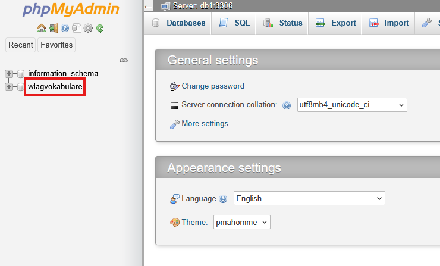
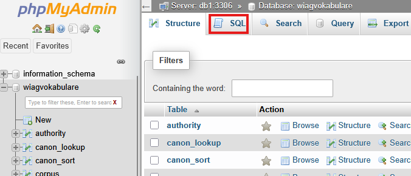
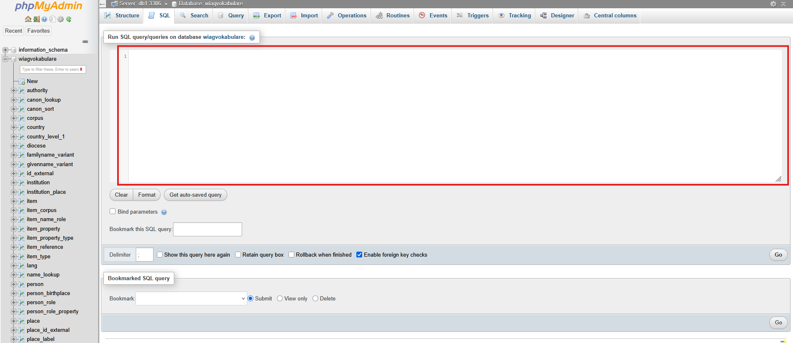
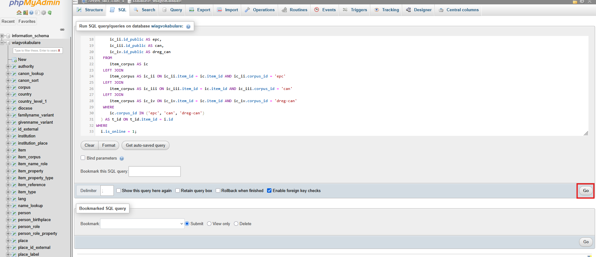
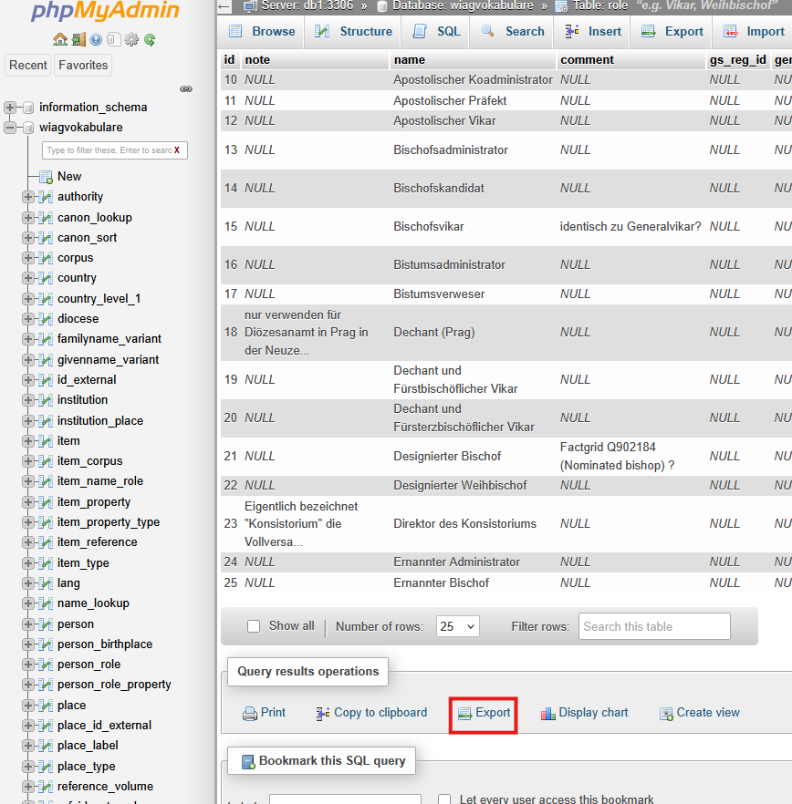
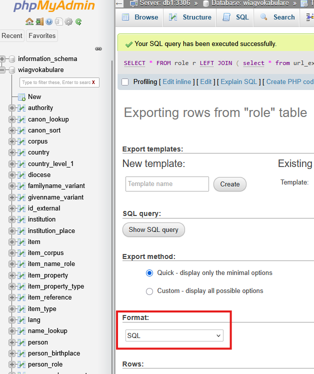
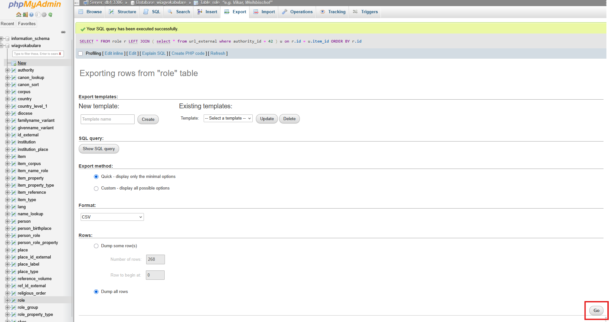

# Running SQL Queries and Exporting Results as CSV

This guide provides instructions for users to run an SQL-query on the databases of WIAG or Digitales Personenregister (DPr) using **phpMyAdmin** and then export the results as a CSV file.

## 1. Open phpMyAdmin
Depending on which database you are trying to access, the link differs:

[phpMyAdmin WIAG](https://vwebfile.gwdg.de/phpmyadmin/)

[phpMyAdmin DPr](https://personendatenbank.germania-sacra.de/phpmyadmin/)

## 2. Log In
Enter your phpMyAdmin login credentials. If you have not yet obtained any, contact Barbara Kroeger.

## 3. Select the database

Click on the **"wiagvokabulare"** or **"gsdatenbank"** database to select it. The choice depends on which phpMyAdmin you opened and logged into ([WIAG](https://vwebfile.gwdg.de/phpmyadmin/) or [DPr](https://personendatenbank.germania-sacra.de/phpmyadmin/)).

## 4. Switch to the SQL-tab
Select the SQL-tab at the top.

## 5. Enter the SQL-query
Paste the query that you want to run in the text field.

## 6. **Execute the Query:**

- To execute the query, click the **"OK"** button.

## 7. Export the results as a CSV-file
You might need to scroll down to see the `Query results operations` section. There click the `Export` button.

Then select the CSV export format (in the `Format` dropdown menu, select `CSV`).

Finally click the `Go` button to download the CSV file.

## Troubleshooting

### SQL Query Errors

- **Syntax Errors:**
  - Ensure the entire SQL query is copied correctly without any missing parts.
- **Permissions:**
  - If you receive a permission error, verify with Barbara Kroeger that your account has the necessary access rights.

### Export Issues

- **Export Button Not Visible:**
  - Make sure you have successfully executed the SQL query before attempting to export.
- **File Not Downloading:**
  - Check your browser's download settings or try using a different browser.