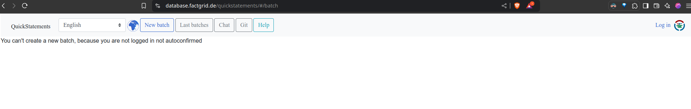
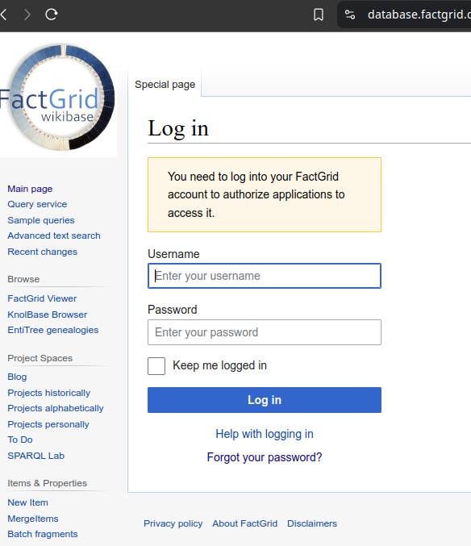
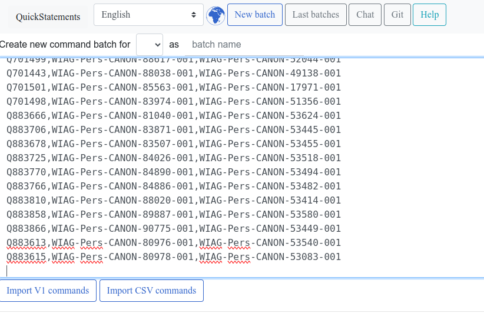
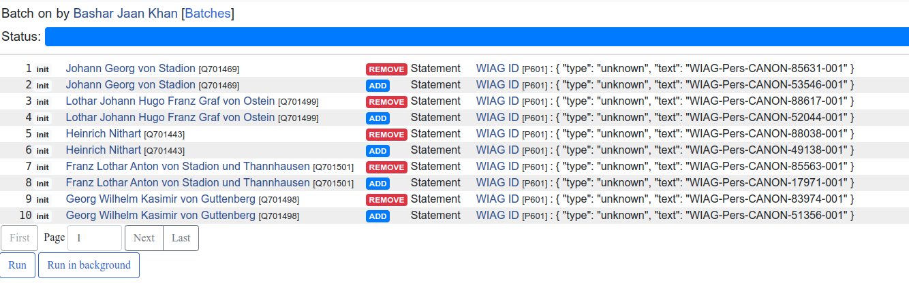

# Updating Factgrid

This guide provides instructions for users to upload data to Factgrid using Quickstatements. This will be done by first logging into Factgrid, creating a batch, pasting the contents of the V1 or CSV file into the text box and then executing the commands.

## Table of Contents

1. [Prerequisites](#prerequisites)
2. [Accessing Factgrid](#accessing-quickstatements-(factgrid))
3. [Creating a new Batch](#creating-a-new-batch)
4. [Running the Update](#running-the-update)
5. [Error handling](#error-handling)

## Prerequisites

- **Credentials:** Obtain your Factgrid login credentials from **Barbara Kroeger**.

## Accessing QuickStatements (Factgrid)

1. **Open Your Web Browser:**

   - Launch your preferred web browser (e.g., Chrome, Firefox, Edge).

2. **Navigate to Factgrid-QuickStatements:**

   - Click the following link (or paste it into the address bar and press Enter):

     https://database.factgrid.de/quickstatements/#/batch

     You will be greeted with the following page.

     

3. **Log In:**

   - Click on the Log in the top right. This will take you to factgrid's login screen.

   

   - **Username:** Enter your provided username.
   - **Password:** Enter your provided password.
   - Click the **Log in** button to log in.
   - Click **Allow** on the next screen. This will bring you back to quickstatements.

## Creating a new Batch

1. Click on "New Batch"

2. In the new screen click on the empty text box and paste the generated text from the V1/CSV file. For copying the contents, open the V1/CSV file using the Notepad Editor or something similar, as Excel may not open it properly.

3. Now the interface should look something like this (the screenshot shows CSV commands, V1 commands would look slightly different):

4. Before you can execute the commands, you need to click `Import V1 commands`/`Import CSV commands`, depending on which type you pasted into the text box.
   

## Running the Update

1. Now that you have imported the commands, the interface should look something like this:

2. Before you execute the commands, its a good idea to check the correctness of these changes. You can quickly access the affected entries by clicking the links.

3. After making sure everything seems correct, execute the commands by clicking `Run`.

## Error handling

Running the query can sometimes lead to errors. These errors cannot be fixed automatically, but must be handled manually.